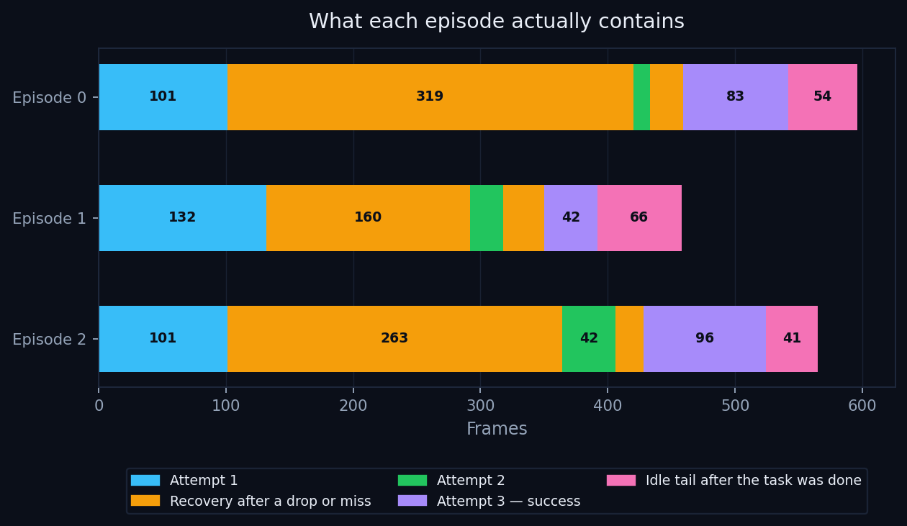
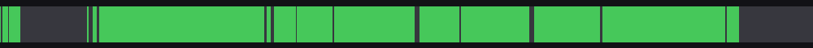
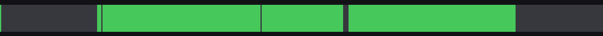
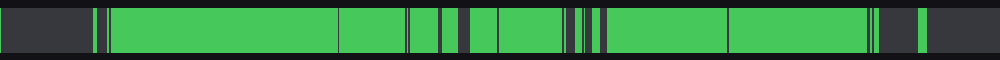
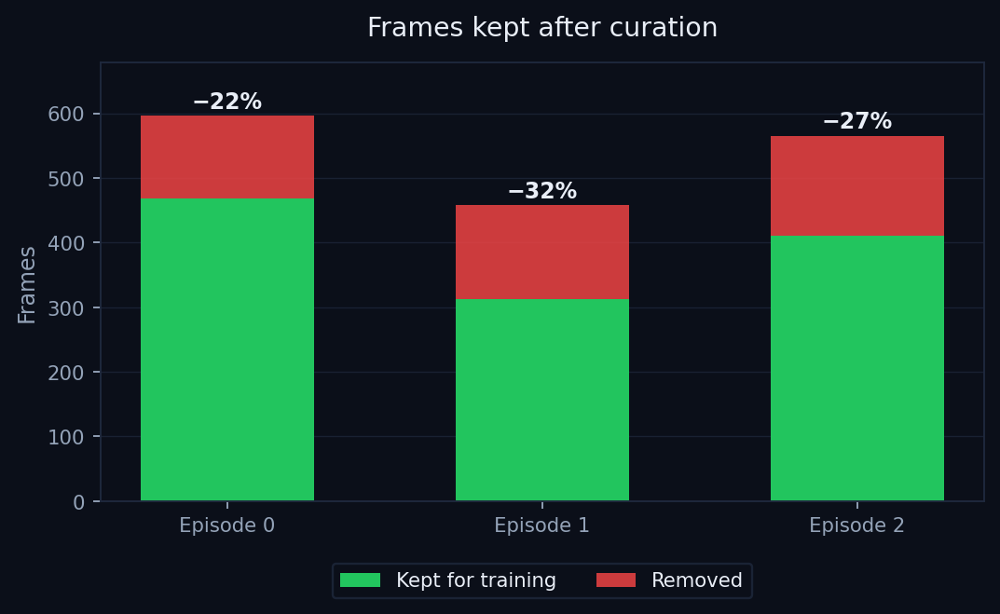
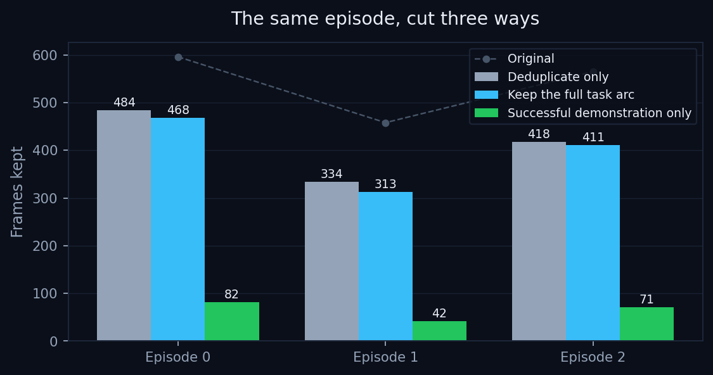
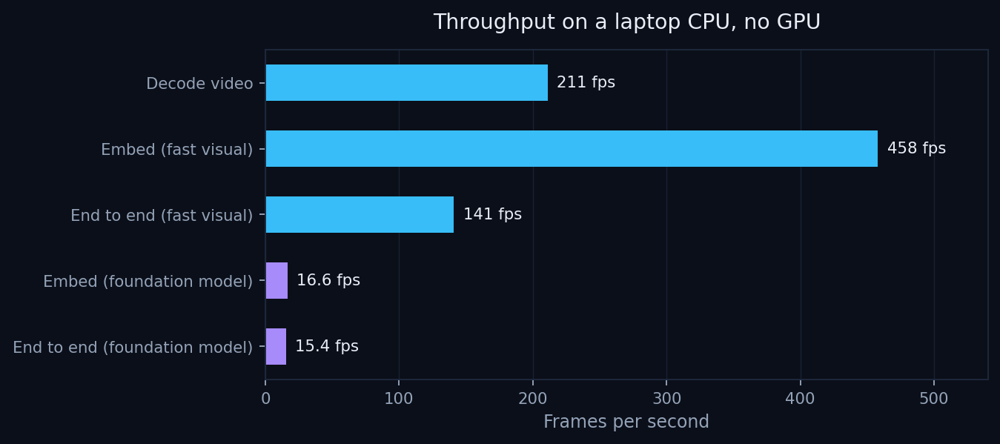

# Yotta Robotics — curation demo

**Robot training data is labelled as if every episode were a clean demonstration. It almost never is.**

Every episode in the dataset below carries one label: *"Grab the Lego and store it in red box."*
Not one of the three we processed is a clean run. All three contain a failure and a recovery the
label never mentions, and all three keep recording after the task is already finished. A model
trained on that data learns that flailing, dropping the part, and sitting still afterwards are all
equally good examples of doing the task.

This repository shows what our pipeline does about it, on real data, with every number reproducible
from [`data/stats.json`](data/stats.json).

**[Live demo](#run-it-on-your-own-clip) — upload a clip and watch it get taken apart.**

---

## The headline

| | |
| --- | --- |
| Episodes whose label hid a failure | **3 of 3** |
| Frames removed, full task arc preserved | **26.4%** |
| Frames removed when only the successful demo matters | **88.0%** |
| Throughput, end to end | **141 fps** on a laptop CPU, no GPU |
| Whole 23,041-frame dataset | **under 3 minutes**, single-threaded |

---

## What actually happened in each episode

The pipeline reconstructs the real structure of an episode from the video and trajectory. No
per-frame labels are needed, and the source recording is never modified.



Every episode follows the same shape the label completely omits: an attempt that fails, a recovery,
a second attempt that also fails, a third that succeeds, and then a stretch of recording after the
task is already done.

| Episode | Frames | Attempts | Recoveries | Idle tail | Finding |
| ---: | ---: | ---: | ---: | ---: | --- |
| 0 | 596 | 3 | 2 | 54 frames | Label describes a clean run; footage contains failure and recovery |
| 1 | 458 | 3 | 2 | 66 frames | Same, plus 2.2s of recording after completion |
| 2 | 565 | 3 | 2 | 41 frames | Same, plus 1.4s of recording after completion |

---

## Results

Each clip below is the original footage with the pipeline's verdict drawn on every frame: green for
frames that survive into the training set, red for frames that are removed, with the phase name and
a timeline strip that fills in as the episode plays. **Click a strip to play the annotated video.**

### Episode 0 — 596 frames, 468 kept, 21.5% removed

[](assets/video/annotated_ep0.mp4)

### Episode 1 — 458 frames, 313 kept, 31.7% removed

[](assets/video/annotated_ep1.mp4)

### Episode 2 — 565 frames, 411 kept, 27.3% removed

[](assets/video/annotated_ep2.mp4)

The curated cuts are alongside them: [episode 0](assets/video/curated_ep0.mp4) ·
[episode 1](assets/video/curated_ep1.mp4) · [episode 2](assets/video/curated_ep2.mp4).



---

## Curation is not one number

What counts as redundant depends on what the data is for. The training goal is an input to the
pipeline rather than something baked into the algorithm, so the same episode can be cut three ways.



| Policy | Frames kept | Removed | When to use it |
| --- | ---: | ---: | --- |
| Deduplicate only | 1,236 | 23.7% | Remove visual redundancy and nothing else. The safe default. |
| Keep the full task arc | 1,192 | 26.4% | Keep failures and recoveries. A policy that has never seen a robot drop something cannot learn to pick it back up. |
| Successful demonstration only | 195 | 88.0% | Keep only the attempt that worked. The aggressive cut for imitation learning. |

Per episode:

| Episode | Original | Dedup only | Full task arc | Success only |
| ---: | ---: | ---: | ---: | ---: |
| 0 | 596 | 484 | 468 | 82 |
| 1 | 458 | 334 | 313 | 42 |
| 2 | 565 | 418 | 411 | 71 |
| **Total** | **1,619** | **1,236** | **1,192** | **195** |

---

## Speed



Measured on an Apple M1 laptop CPU with no GPU. The fast visual path runs the whole thing at
141 fps end to end, which puts the full 23,041-frame dataset at under three minutes single-threaded.
Swapping in a foundation-model embedding raises quality and costs roughly an order of magnitude in
speed — the right trade on a GPU, the wrong one on a laptop.

| Stage | Fast visual | Foundation model |
| --- | ---: | ---: |
| Decode video | 211 fps | 211 fps |
| Embed | 458 fps | 16.6 fps |
| End to end | 141 fps | 15.4 fps |

---

## Run it on your own clip

The hosted demo accepts a short robot episode and runs the same pipeline: failure and recovery
detection, proposed phase labels, and a curated cut you can play back against the original.

Uploads are capped at 50 MB and 45 seconds. Nothing is retained — uploads and results are deleted an
hour after processing.

A video-only upload has no joint trajectory attached, so the kinematic signals sit out and the
decisions come from what the camera sees plus the detected task structure. With a full dataset the
motion and gripper signals refine the result further. The demo says so in its own output rather than
quietly pretending otherwise.

---

## What the pipeline does

Nine capabilities, composable so a team adopts only the stages it needs. Each writes a sidecar next
to an untouched recording, so any stage can be used alone and audited independently.

| | Stage | What it does |
| ---: | --- | --- |
| 01 | Ingest and normalize | Pull datasets from Hugging Face, convert trajectories plus camera video into one reviewable timeline |
| 02 | Label scaffolding | Generate and validate time-ranged annotation templates |
| 03 | Action-state inference | Open-vocabulary metadata over frame windows, via a local vision model or a dependency-free heuristic |
| 04 | Geometry enrichment | Depth, surface normal, and segmentation sidecars from a pluggable vision provider |
| 05 | Quality assessment | Score clips against blessed exemplars using dense retrieval, lexical search, defect gates, and trajectory matching |
| 06 | Frame curation | Visual drift keyframing fused with kinematic signals, so real motion is never mistaken for redundancy |
| 07 | Failure detection | Find dropped objects, re-grasps, backtracks, and post-success idle inside a single episode |
| 08 | Annotation QA | Cross-check labels against the footage, flag the ones that lie, propose corrected phase labels |
| 09 | Training handoff | Pruned datasets, curated video, and annotation sidecars with verified-lossless state and action round-trip |

---

## This repository

```
assets/
  video/      annotated and curated MP4s for episodes 0-2
  charts/     the four charts above
  timeline/   per-episode keep/drop strips
data/
  stats.json  machine-readable source for every number on this page
api/          FastAPI service for the live demo
web/          Astro + Tailwind frontend
```

The curation pipeline itself is a private package and is not published here. `api/` contains no
algorithm code: its entire pipeline surface is a single call that returns an already-sanitized
result, so the public service cannot expose internals even by accident.

### Running the frontend

```bash
cd web
npm install
npm run dev
```

The published results render without any backend. Set `PUBLIC_API_BASE_URL` to enable live uploads.

### Running the API

Requires access to the private pipeline package. See [`api/README.md`](api/README.md).

---

## Dataset

Results were produced from the
[LeRobot worldwide hackathon Quarter Brain lego-picking dataset](https://huggingface.co/datasets/LeRobot-worldwide-hackathon/320-Quarter_Brain-lego_picking):
46 episodes, 23,041 frames, side camera at 30 fps. Episodes 0, 1, and 2 were processed end to end
for this write-up.
